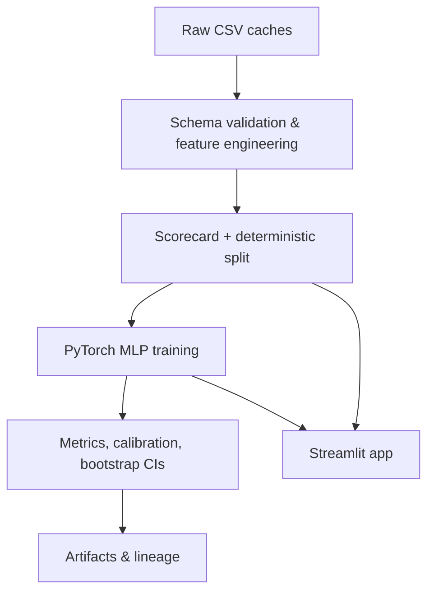

# Overview

Oncotarget Lite is a lean, laptop-first pipeline for immunotherapy target triage. The project keeps scientific behaviour intact while hardening packaging, observability, and reproducibility so every run can be trusted and repeated offline.

!!! note
    All datasets are synthetic caches that emulate GTEx, TCGA, DepMap, UniProt, and STRING summaries. No network access is required at runtime.

## Architecture

## Highlights

- **Single installable package** with PEP 621 metadata, console script, and optional extras for visualisation and local development.
- **Deterministic ML pipeline** covering feature engineering, MLP training, calibration metrics, bootstrap confidence intervals, and Parquet artifacts.
- **Data contracts and lineage** enforced via Pydantic + polars with SHA256 checksums on every CSV input.
- **Structured logging** with run + lineage identifiers and optional MLflow logging (disabled by default).
- **Developer ergonomics**: MkDocs docs, Ruff/Mypy/Pytest CI on Python 3.10–3.12, docker image, and coverage gate ≥90%.

## What ships with each run?

- JSON `metrics.json` including AUROC/AUPRC/Brier/ECE with bootstrap CIs and calibration bins.
- `predictions.parquet` with train/test probabilities and labels.
- `feature_importances.parquet` derived from the first-layer weights of the MLP.
- `scores.parquet` with the interpretable scorecard ranking.
- `lineage.json` containing file hashes, git SHA, environment info, and config parameters.

<!-- BEGIN: METRICS TABLE -->

## Benchmark (deterministic CI)

| Metric | Mean | 95% CI | N | Dataset | Git SHA |
|--------|------|--------|---|---------|---------|
| AUROC | 0.955 | [0.949, 0.961] | 5 | tiny-synthetic | 69b7921 |
| AUPRC | 0.947 | [0.926, 0.962] | 5 | tiny-synthetic | 69b7921 |
| Accuracy | 0.917 | [0.903, 0.929] | 5 | tiny-synthetic | 69b7921 |
| ECE | 0.045 | [0.041, 0.049] | 5 | tiny-synthetic | 69b7921 |

<!-- END: METRICS TABLE -->
